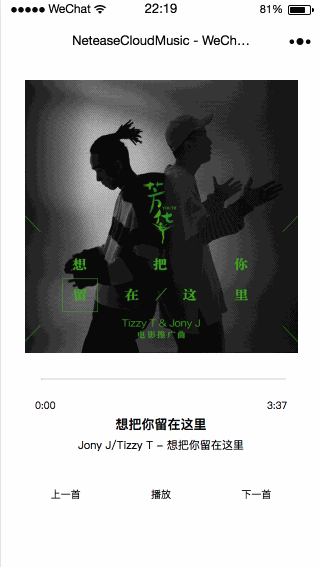

# zong-music

> A WeChat project

## Build Setup

```bash
# 安装NeteaseCloudMusicApi
$ git clone git@github.com:Binaryify/NeteaseCloudMusicApi.git
$ npm install

# 运行
$ node app.js

# 启动小程序
```
## 演示

